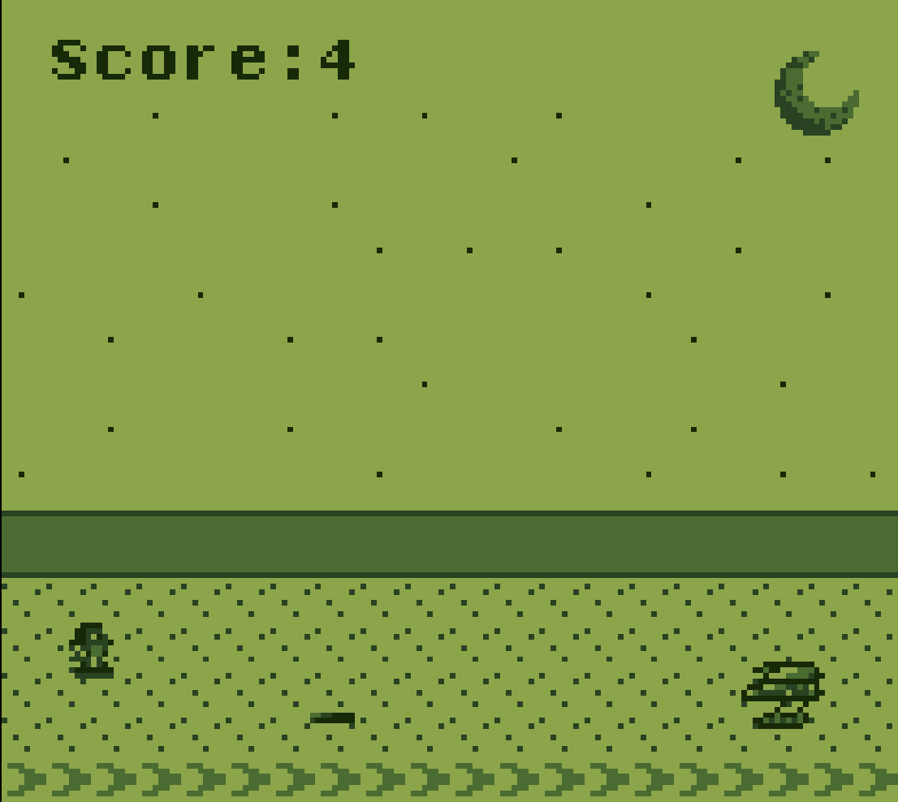
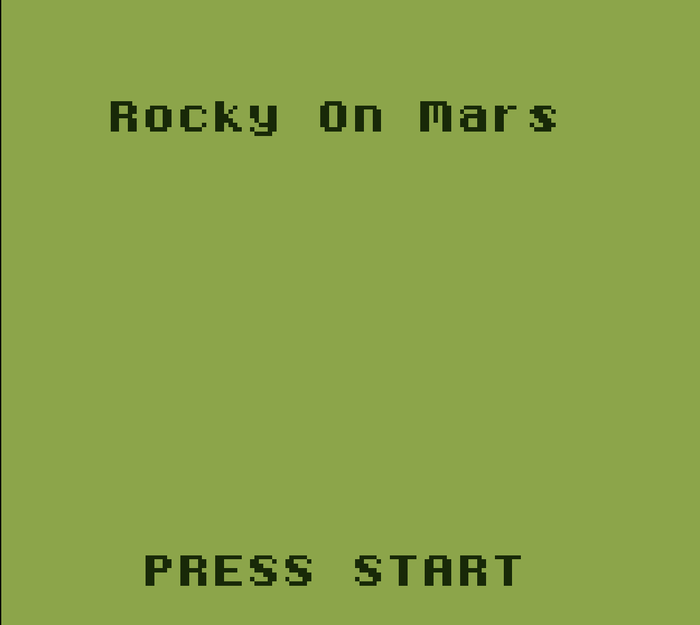
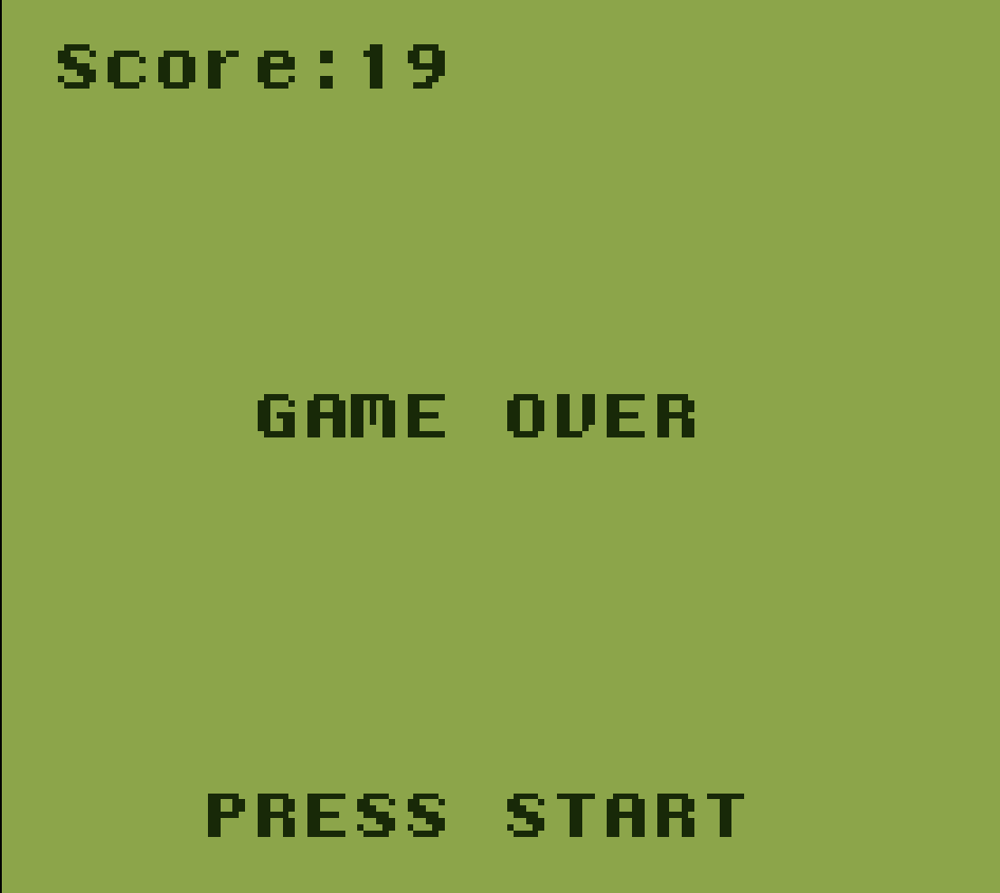

# RockyOnMars <!-- omit from toc -->

Armed with a high-tech hoverboard and an indomitable spirit, Rocky is on a mission to explore the red planet, but can he survive the alien attacks?

### Table of contents <!-- omit from toc -->
- [Downloads](#downloads)
- [Controls](#controls)
- [Screenshots](#screenshots)
    - [Gameplay](#gameplay)
    - [Title](#title)
    - [Game over](#game-over)
- [Build instructions](#build-instructions)
- [Credits](#credits)

# Downloads
[](https://github.com/Bojidarist/RockyOnMars/releases)
[](https://bojidarist.itch.io/rocky-on-mars)

# Controls
| Movement | Start/Continue |
| -------- | -------------- |
| D-pad    | Start          |


# Screenshots
### Gameplay


### Title


### Game over


# Build instructions

1. Download [gbdk-2020](https://github.com/gbdk-2020/gbdk-2020/releases).
2. Extract gbdk somewhere on your computer.
3. Clone the repository.

```bash
git clone git@github.com:Bojidarist/RockyOnMars.git && cd RockyOnMars
```

4. Set **GBDKDIR** environment variable.

```bash
export GBDKDIR=/path/to/gbdk/
```

5. Run `make` in root directory.
6. Open the generated **.gb** file from the **out** directory in your emulator.

# Credits

- Programming: Bojidar Qnkov
- Visuals: Lyubomir Dimitrov
